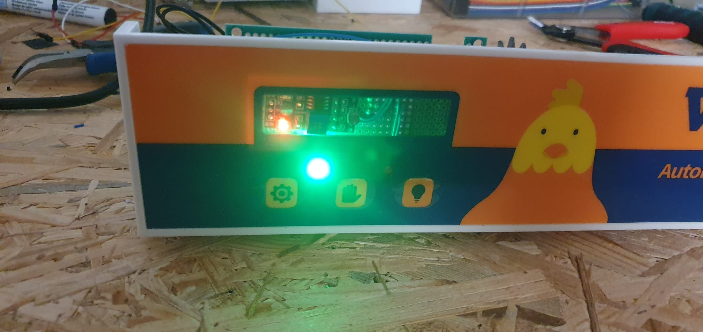
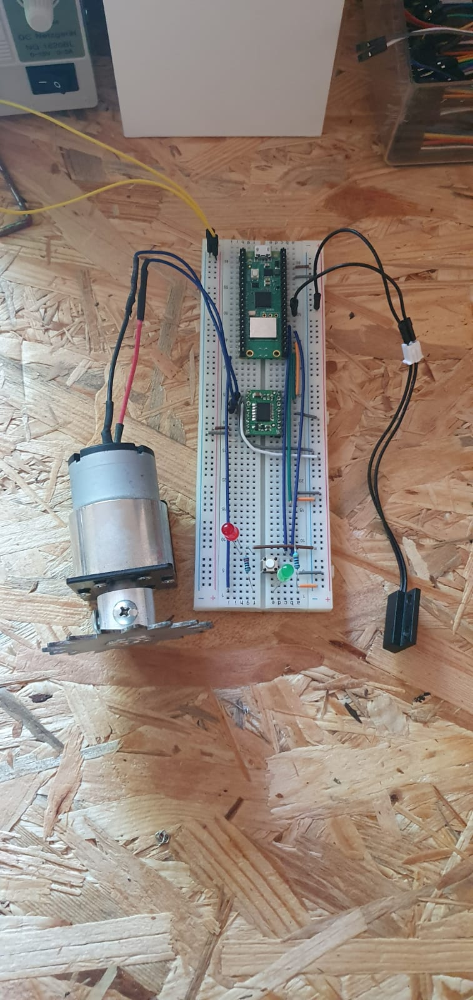
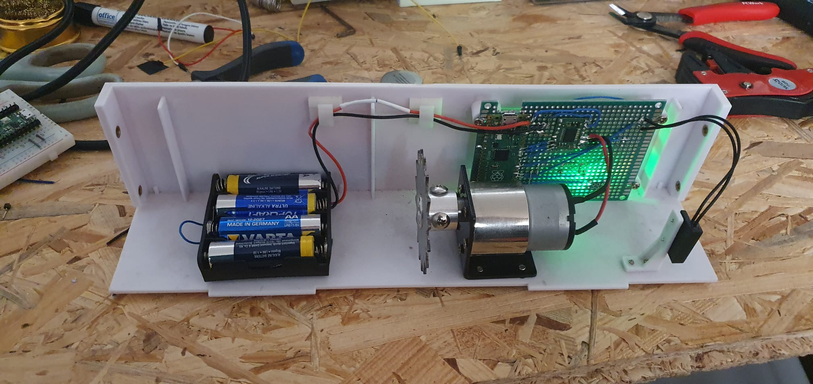
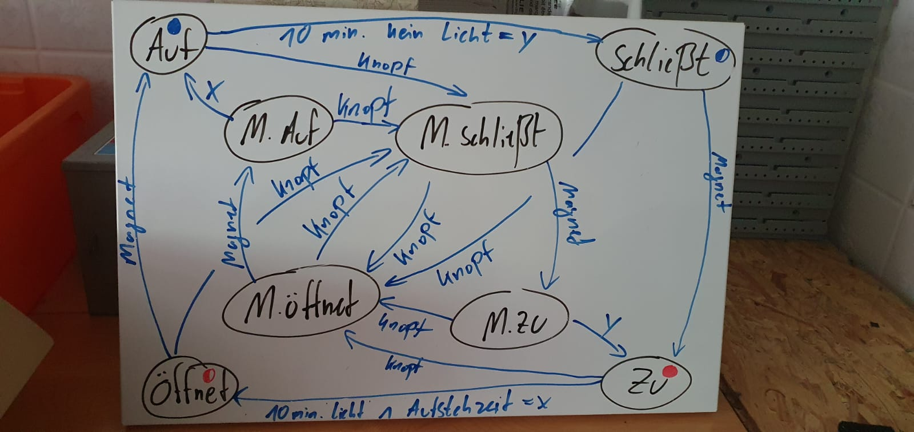
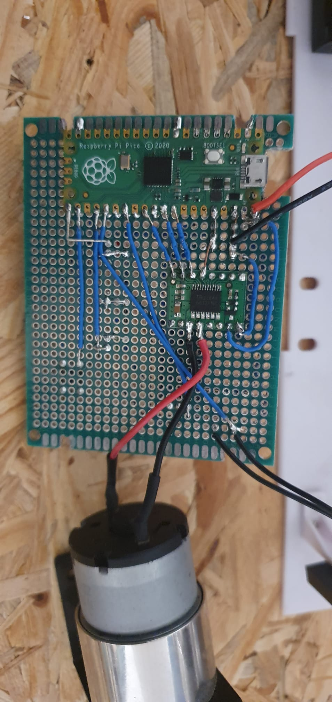
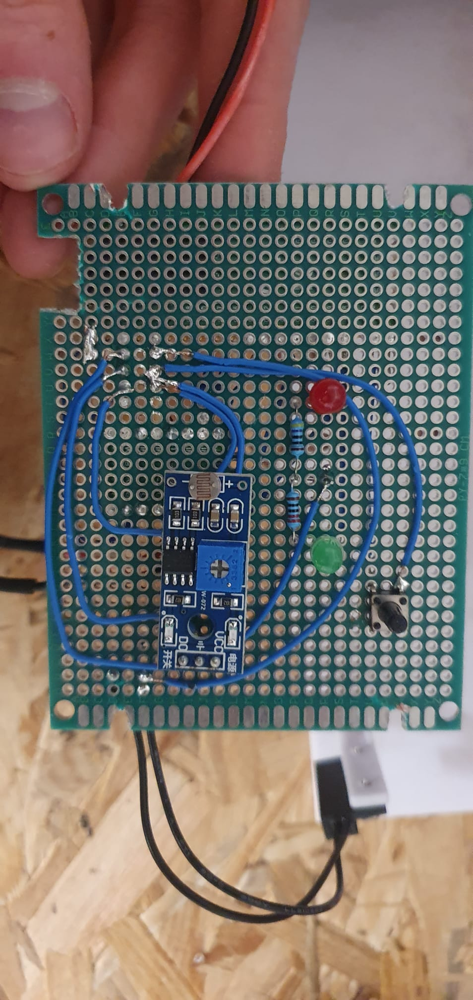
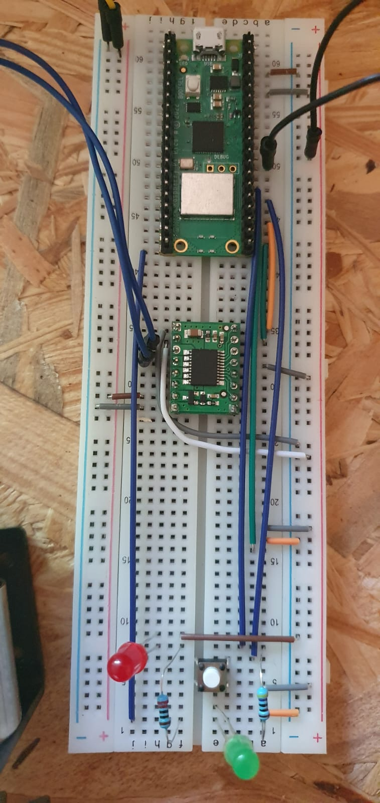

# ChickenDoor
Fixing a broken automatic chicken door by replacing its electronics with an RPI Pico and some sensors.

## Hardware
- Raspberry Pi Pico
- Light sensor
- Magnet Sensor
- Motor controller md08a
- Motor
- Button
- LEDs

## Door Mechanism
The door itself is a metal sheet with a row of holes along its length. The teeth on the motor engage in these holes and move the plate up or down while the motor spins. The Door additionally includes a magnet on each side. Thanks to these magnets, a magnet sensor can be used to determine if the door has reached the open/close position and should be stopped.
Using a light sensor, the system is able to automatically open/close at the correct light level.
The LEDs indicate the current state, and the button can be used to manually change states.

## Settings & Wiring
In the first code block "Settings" in "main.py", you can specify settings like the light sample period or motor speed.
The second code block "IO pins" can be modified to select the correct Gpio pins for sensors etc. of your configuration.

